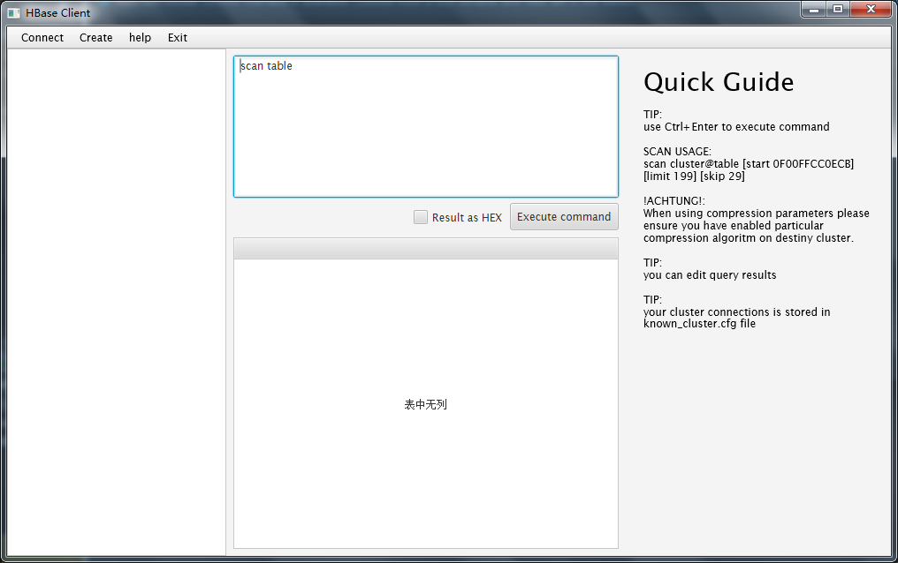

# HBaseGuiClient
Ref : [HBaseGuiClient](https://github.com/tzolkincz/HBaseGuiClient)

由于完全离线环境搭载的CDH 6.2.0 并且需要查询hbase 2.1.0中的数据，所以找了些工具，多数都不能用，有些需要下载对应的jar包的，但是连他们的服务器都ping不通，所以git上找到一个稍微合适的
工具，并附有源码，虽然有些小地方需要改，但是不影响大体使用，隧修改并提交。对代码贡献者表示敬意。

1、修改了部分样式

  样式中表格查询结果部分可以自适应高度。帮助提示可以关闭。
2、修改了可以连接hbase 2.1.x版本。

  修改了pom中的hbase-client的jar包版本。
3、并且可以查询命名空间中的表信息。

  本身项目中使用到命名空间。而原先的代码或者jar包版本不适用。并随之更改。
  
注意：我仅仅使用到其查询数据展示功能。所以建表以及修改数据等功能并没有深入使用并测试。但是以我简单使用看来编辑数据功能还是可以。

